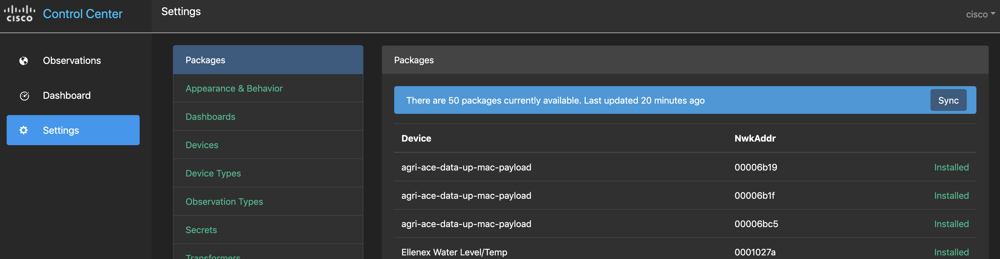

# xDP Control Center packaging #

_"xDP's app store"_

One important goal for xDP is to ensure that a device "just works" when it arrives on site. This repository provides all that is required to support a sensor on xDP, including code to transform from a binary payload to a normalized model. When a device is provisioned for a specific site in xDP's cloud e.g. a specific farm, then all of its information will be pulled by the edge-based xDP Control Center's "Packages" screen, shown below:



In addition, dashboards associated with the device and programs responsible for transforming its binary data, are automatically pulled down as well. The end result is that the on-site user is able to visualize data as soon as it starts feeding through; and all with no configuration required by them.   

## Development

> See inside the `ict-weather-station` folder for a great example of how to go about local development and testing of device integrations.

When developing a device integration, there are generally two types of concern:

* the device-specific packaging
* general packaging

The following directories shows the packages in relation to a specific sensor, in this case, the Ellenex Water Level/Temp sensor:

```
+ ellenex-water-level-temp  <-- device specific
 - end-device-types
 - transformers
+ water-level-temp          <-- general
 - dashboards
 - observation-types
```

As the size of the repository grows, there should be less need to create general packaging as this represents the normalized model. Additions will therefore be focused more on device specific integrations.

## License ##

This code is licensed under the Apache V2 license. Please see the LICENSE file for more.
